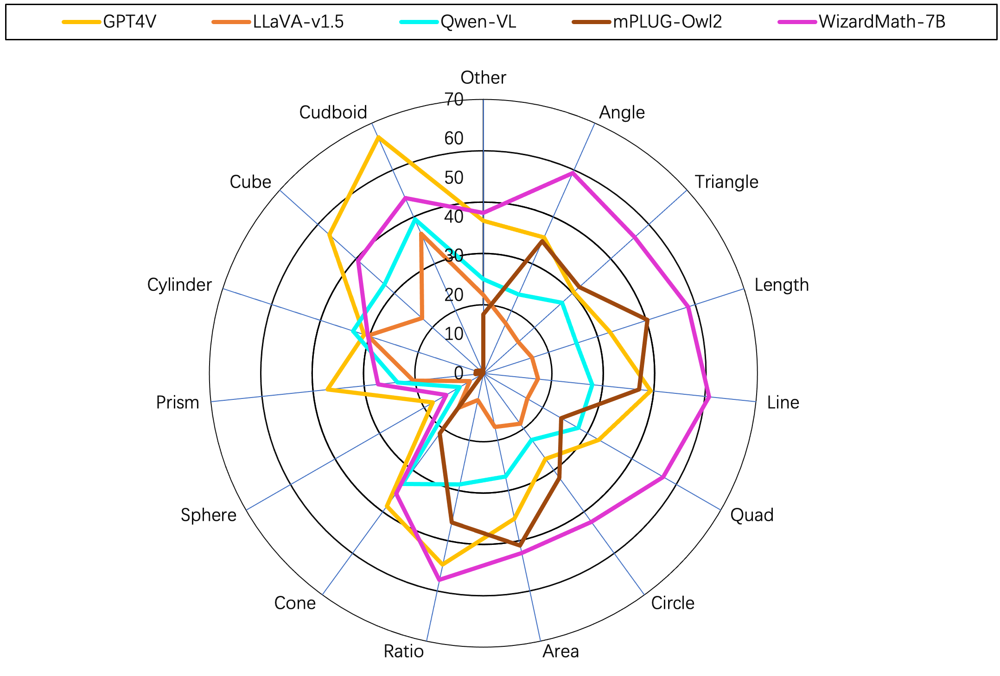
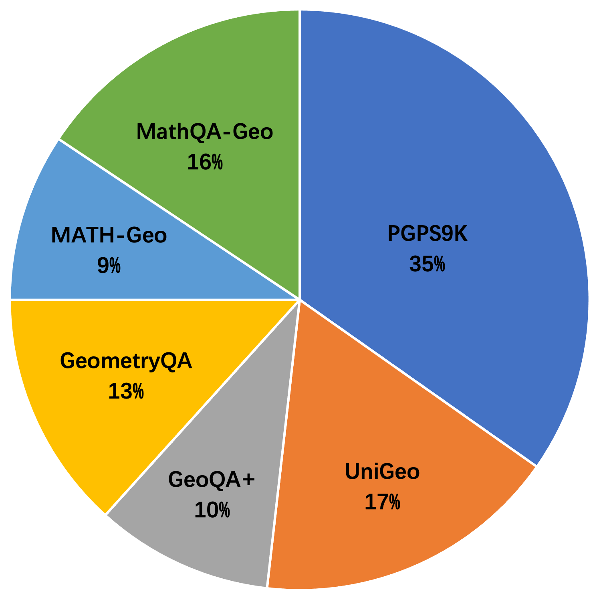
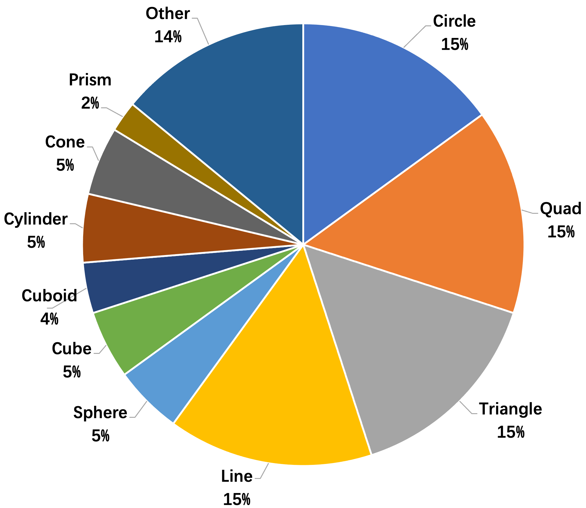
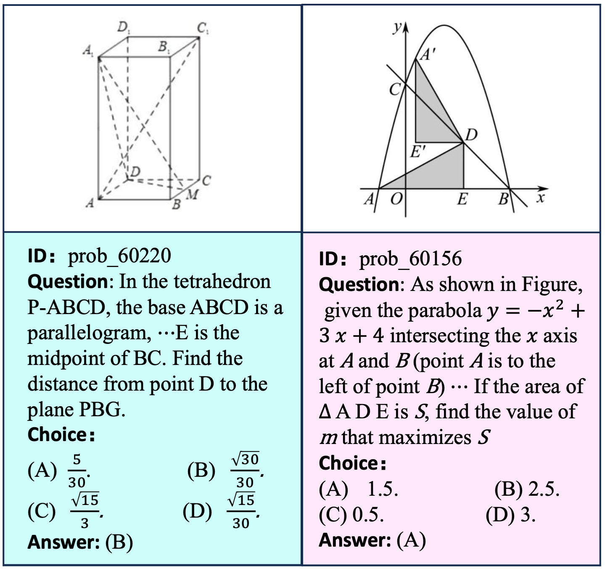

# GeoEval
 
 
  
 
 


This is the Repository for Geometry Problem Solving Method Evaluation

Code for the Paper "GeoEval: Benchmark for Evaluating LLMs and Multi-Modal Models on Geometry Problem-Solving".


## Overview

This project comprises a LLM evaluation of Geometry Problem Solving methods and the construction of comprehensive datasets. The aim is to advance the field of solving geometry problems. The project is focused on the construction of datasets in the field of geometry problem solving and to provide a comprehensive evaluation of current large language models.

# DataSet Download

Our Open Dataset can be found at [GeoEval](https://pan.baidu.com/s/1t-VJZIFJS8C6fiLZP8-B8Q).

## About GeoEval
The GeoEval benchmark is specifically designed for assessing the ability of models in resolving geometric math problems. This benchmark features five characteristics: Comprehensive Variety, Varied Problems, Dual Inputs, Diverse Challenges, and Complexity Ratings.

For an insightful contrast, we offer a comparative analysis of GeoEval against earlier datasets.


The GeoEval benchmark is specifically designed for assessing the ability of models in resolving geometric math problems. This benchmark features five characteristics: Comprehensive Variety, Varied Problems, Dual Inputs, Diverse Challenges, and Complexity Ratings.

For an insightful contrast, we offer a comparative analysis of GeoEval against earlier datasets.


<p align="center">
 <br>
</p>

GeoEval Benchmark Features
Comprehensive Variety: The benchmark covers a wide range of geometric topics, providing a comprehensive test for models.

__Varied Problems__: Problems in the benchmark are varied, testing the model's ability to handle different types of geometric problems.

<div style="text-align: inline-block;">
    <div style="display: inline-block;">
        
    </div>
    <div style="display: inline-block;">
        
    </div>
</div>

__Dual Inputs__: The benchmark includes both text and diagram inputs, testing the model's ability to process and integrate information from different sources.

__Diverse Challenges__: The benchmark poses diverse challenges, testing the model's ability to handle complex and varied geometric problems.

__Complexity Ratings__: The benchmark includes problems of different complexity levels, allowing for a nuanced assessment of the model's capabilities.


<p align="center">
 <br>
</p>
## Table of Contents

1. [Data Preparation](#data-preparation)
   - [Download Initial Dataset](#download-initial-dataset)
   - [Preprocess Data](#preprocess-data)
   
2. [Model Evaluation](#model-evaluation)


## Model Evaluation

Run the scripts under sh_files/{model} to achieve inference responsiveness, result extraction, and metric calculation for large models.

```bash
bash sh_files/{model_name}/evaluate_general.sh
bash sh_files/{model_name}/ext_all.sh
bash sh_files/{model_name}/caculate_score.sh
bash sh_files/{model_name}/caculate_aug_score.sh
bash sh_files/{model_name}/caculate_back_score.sh
bash sh_files/{model_name}/caculate_solid_score.sh
bash sh_files/{model_name}/caculate_score.sh
```

##  🏆 Leaderboard 🏆

| Model                    | GeoEval-2000 (A/T %) | GeoEval-backward (A %) | GeoEval-aug (A %) | GeoEval-hard (A %) |
|--------------------------|----------------------|------------------------|-------------------|--------------------|
| CodeGen2-16B $\lozenge$  | 28.76 / 22.06         | 5.10                   | 8.50              | 5.66               |
| GPT-3.5 $\lozenge$       | 24.71 / 21.27         | 22.66                  | 41.25             | 22.33              |
| GPT-4 $\lozenge$         | 27.95 / 43.86         | 26.00                  | 45.75             | 10.10              |
| WizardMath-70B $\lozenge$| **55.67** / 34.20    | 28.66                  | 37.75             | 6.00               |
| WizardMath-7B-V1.1 $\lozenge$| 54.78 / 32.76    | 32.66                  | **47.75**         | 6.00               |
| llava-7B-V1.5            | 12.80 / 21.01         | 11.33                  | 20.25             | 20.30              |
| Qwen-VL                  | 25.60 / 25.97         | 5.66                   | 22.25             | 21.66              |
| mPLUG-Owl2               | 37.76 / n/a           | **35.33**               | 38.00             | **22.66**          |
| InstructBLIP $\dagger$   | **52.18** / n/a       | 15.66                  | 35.00             | **70.30**          |
| GPT-4V                   | 37.22 / **43.86** $\ddagger$ | 26.00            | 45.75             | 10.10              |
 


